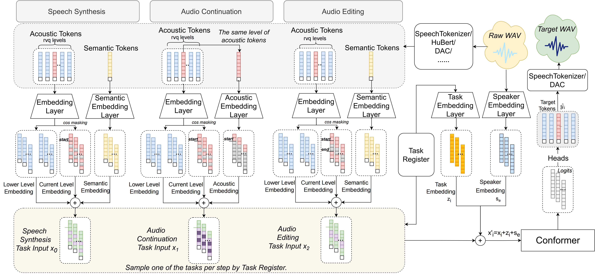

## hi

## introduction
Recent advancements in non-autoregressive audio generation have garnered significant attention. However,traditional single-task speech synthesis methods focus primarily on mapping semantic tokens to acoustic tokens, which overlooking the internal relationships within acoustic features. Addressing this gap, we introduce SpeechSEC, a unified multi-task framework designed for Speech Synthesis, Editing, and Continuation tasks by dynamically adjusting input conditions. SpeechSEC not only enhances speech synthesis performance in speech intelligibility, audio quality, voice preservation by acquiring shared and diverse knowledge across different tasks,  but also efficiently executes editing and continuation tasks with good performance via non-autoregressive techniques. Additionally, SpeechSEC exhibits a strong adaptability to current speech discretization methods, like Hubert, Descript-Audio-Codec and SpeechTokenizer, which showcases robustness of our approach. Audio samples are available.

## 框架图

## 创新点描述

## 语音合成的demo

## 语音编辑的demo

## 语音延续的demo
